# 🌈 Campus Guardian Access AI

[](https://www.python.org/)
[](https://streamlit.io/)
[](https://github.com/ultralytics/ultralytics)
[](https://github.com/google/mediapipe)
[](https://deepmind.google/technologies/gemini/)

> **Rompiendo barreras de comunicación y previniendo la deserción en tiempo real mediante Visión Artificial e Inteligencia Artificial Generativa.**

---

## 📌 Visión General

**Campus Guardian Access AI** es una plataforma inteligente de **Inclusión Académica Bidireccional** y **Alerta Temprana** diseñada para ejecutarse de manera fluida en hardware de recursos limitados (como computadores escolares con CPU Core i5 y 10 GB de RAM). 

El proyecto resuelve dos problemas críticos del aula moderna:
1. **Exclusión Comunicativa**: Estudiantes sordos o con discapacidad del habla a menudo carecen de canales fluidos de comunicación con el docente. Esta herramienta les permite transcribir la voz del profesor a texto y solicitar ayuda o participación a través de señas detectadas automáticamente por la cámara web.
2. **Deserción Escolar Invisible**: Monitorea de forma no invasiva el nivel de fatiga (somnolencia) y el uso de celulares (distracción digital) para calcular el **Índice de Engagement Académico (AEI)**, permitiendo a los profesores actuar a tiempo gracias a las recomendaciones pedagógicas generadas con **Google Gemini**.

---

## 🏗️ Arquitectura del Sistema

El sistema utiliza una arquitectura desacoplada de **Productor-Consumidor** que evita bloqueos y maximiza el rendimiento de la CPU:

```mermaid
graph TD
    A[🎥 Webcam Capture 640x480] --> B[🧠 Módulo de Visión detection_yolo.py]
    B --> C{Inferencia Inteligente}
    C -->|Personas, Celulares, Laptops| D[YOLOv8n imgsz=320]
    C -->|Parpadeo y Fatiga Ocular| E[MediaPipe Landmarks]
    D --> F[📝 live_state.json Escritura Atómica]
    E --> F
    F --> G[📊 Dashboard Streamlit app_streamlit.py]
    F --> H[💾 FiftyOne Pipeline Dataset Curation]
    
    G --> I[🤖 Google Gemini API / Fallback Local]
    I --> J[💡 Recomendaciones Pedagógicas Activas]
    
    style B fill:#0f172a,stroke:#38bdf8,stroke-width:2px;
    style F fill:#1e1b4b,stroke:#818cf8,stroke-width:2px;
    style G fill:#064e3b,stroke:#34d399,stroke-width:2px;
```



---

## ✨ Características Principales

* **Inclusión Bidireccional Activa**:
  * **Voz a Texto**: Transcripción instantánea de la voz del profesor en pantalla (simulación interactiva mediante botones presets).
  * **Traducción de Señas**: Alertas parpadeantes automáticas en el dashboard del docente al detectar gestos y señas (`🙋 Participar`, `⚠️ Ayuda con Código`, `✅ Actividad Terminada`).
* **Módulo de Alerta Temprana**:
  * Detección de fatiga en tiempo real (somnolencia ocular) mediante landmarks de MediaPipe.
  * Identificación de objetos distractores (teléfonos celulares) mediante YOLOv8n.
* **Índice de Engagement Académico (AEI)**:
  * Métrica unificada que evalúa Asistencia, Atención, Participación y Actividades en tiempo real.
* **Mentor Pedagógico Inteligente**:
  * Diagnósticos detallados y planes de acción inmediatos generados con el modelo `gemini-2.0-flash-lite`.
  * Cuenta con un **motor de reglas offline de respaldo (fallback)** en caso de pérdida de conexión o falta de API Key.
* **Modo Manual de Garantía**:
  * Selector en la barra lateral para simular todos los comportamientos físicos sin depender de la cámara, asegurando una demo 100% exitosa ante jurados de hackathon.

---

## ⚡ Optimizaciones de Rendimiento para CPU i5 y 10GB RAM

Para asegurar tasas de refresco fluidas de **5+ FPS** sin congelar el computador, implementamos:
1. **Limitación de Hilos en PyTorch**: Restricción explícita de subprocesos a 2 (`torch.set_num_threads(2)`) en el backend para evitar la saturación de núcleos y la ralentización del renderizado.
2. **Inferencia a Baja Resolución**: YOLOv8 opera a un tamaño de imagen optimizado de `320px` (en lugar de `640px`), reduciendo el uso de CPU en más de un 60%.
3. **Escritura Atómica con Reemplazo a Nivel de S.O.**: La comunicación de datos se realiza escribiendo un archivo temporal (`live_state.json.tmp`) y renombrándolo atómicamente, garantizando que el Dashboard nunca lea datos corruptos o incompletos.
4. **Desactivación de Históricos por Defecto (`SAVE_HISTORIC_FRAMES = False`)**: Evita la degradación del almacenamiento secundario debido a operaciones masivas de escritura I/O de archivos `.jpg`.
5. **Renderizado de Interfaz Reactiva con `@st.fragment`**: Actualiza solo los contenedores de datos necesarios en Streamlit, eliminando los molestos parpadeos y permitiendo interacción en tiempo real en los paneles de control.

---

## 🛠️ Requisitos e Instalación

### Requisitos Previos
* **Python**: Versión 3.10 o superior (Recomendado: 3.14.x).
* **Webcam**: Cualquier cámara web interna o USB estándar conectada al sistema.
* **Dependencias del Sistema (Esencial para Linux/Ubuntu)**:
  Dado que el proyecto utiliza OpenCV para visión computacional, asegúrate de tener las librerías gráficas del sistema instaladas. En sistemas Debian/Ubuntu, ejecuta:
  ```bash
  sudo apt update
  sudo apt install -y libgl1-mesa-glx libglib2.0-0 ffmpeg
  ```

### Instalación Paso a Paso

1. **Clonar el Repositorio**:
   ```bash
   git clone https://github.com/alejandro-xoxo/HachatonCampuslans2026.git
   cd HachatonCampuslans2026
   ```

2. **Preparar el Entorno Virtual**:
   * **Opción A: Usar el entorno virtual existente** (si ya lo tienes configurado en el directorio padre):
     ```bash
     source ../.venv/bin/activate
     ```
   * **Opción B: Crear un nuevo entorno virtual desde cero**:
     ```bash
     python -m venv .venv
     source .venv/bin/activate  # En Windows usa: .venv\Scripts\activate
     ```

3. **Instalar Dependencias de Python**:
   Una vez activado tu entorno virtual (Opción A o B), instala los paquetes requeridos:
   ```bash
   pip install --upgrade pip
   pip install -r requirements.txt
   ```

4. **Configurar Variables de Entorno (Opcional para Gemini)**:
   Crea un archivo `.env` en la raíz del repositorio y añade tu API key de Google Gemini:
   ```env
   GEMINI_API_KEY=tu_api_key_aqui
   ```
   *Nota: Si no configuras la API key, la plataforma se ejecutará perfectamente en modo offline usando un motor de reglas determinista local para no detener la demo.*


---

## 🚀 Guía de Ejecución

Para iniciar todo el ecosistema de Campus Guardian, abre varias consolas y ejecuta los comandos según tu sistema operativo:

### 1. Terminal 1: Servidor del Dashboard (Streamlit)
* **Linux / macOS**:
  ```bash
  source .venv/bin/activate  # O: source ../.venv/bin/activate
  streamlit run dashboard/app_streamlit.py --server.port 8501
  ```
* **Windows (CMD / PowerShell)**:
  ```cmd
  .venv\Scripts\activate
  streamlit run dashboard/app_streamlit.py --server.port 8501
  ```
  *(Accede en tu navegador a: [http://localhost:8501](http://localhost:8501))*

### 2. Terminal 2: Bucle de Visión Artificial (YOLOv8 & MediaPipe)
* **Linux / macOS**:
  ```bash
  source .venv/bin/activate  # O: source ../.venv/bin/activate
  python vision/detection_yolo.py
  ```
* **Windows (CMD / PowerShell)**:
  ```cmd
  .venv\Scripts\activate
  python vision/detection_yolo.py
  ```

## 💾 Integración y Uso de FiftyOne

El proyecto utiliza **FiftyOne** para la gestión, análisis de calidad y curación de los datos recolectados por el sistema de visión artificial. Esto permite inspeccionar visualmente cuándo y por qué los estudiantes se distraen (por ejemplo, mostrando la detección de teléfonos celulares).

### 🛠️ Lógica del Pipeline de Datos (`fiftyone_pipeline.py`)
1. **Conexión por Tubería**: Recibe el flujo de frames y detecciones en formato JSON directamente del stdout de YOLOv8.
2. **Control de Almacenamiento (FIFO)**: Para evitar que el disco se llene en el ordenador de la escuela, el pipeline mantiene la base de datos acotada a un máximo de **100 muestras**. Cuando ingresa un nuevo frame, el script borra automáticamente el archivo `.jpg` más antiguo y su registro.
3. **Filtro de Distracciones**: Aplica una consulta dinámica sobre las detecciones para filtrar y mostrar en el panel únicamente los frames donde se detectó un teléfono celular (`cell phone`).

---

### 🚀 Cómo Ejecutar la Visualización con FiftyOne

#### Opción A: Prueba de Instalación Rápida
Si quieres comprobar que la librería funciona correctamente en tu máquina sin activar la cámara web:
* **Linux / macOS**:
  ```bash
  source .venv/bin/activate
  python test_fiftyone.py
  ```
* **Windows (CMD / PowerShell)**:
  ```cmd
  .venv\Scripts\activate
  python test_fiftyone.py
  ```
*Esto creará un dataset simulado y abrirá el panel en tu navegador automáticamente.*

#### Opción B: Pipeline de Visión + FiftyOne Acoplados (Captura Real)
Para capturar video de tu cámara web e importarlo y filtrarlo en tiempo real hacia FiftyOne:
* **Linux / macOS**:
  ```bash
  source .venv/bin/activate
  python vision/detection_yolo.py | python fiftyone_app/fiftyone_pipeline.py
  ```
* **Windows (CMD / PowerShell)**:
  ```cmd
  .venv\Scripts\activate
  python vision/detection_yolo.py | python fiftyone_app/fiftyone_pipeline.py
  ```
* **Inspección de Resultados**: 
  1. Al presionar **Ctrl+C** en esa terminal, se cerrará la cámara web.
  2. El pipeline calculará e imprimirá en consola estadísticas de detección (personas, celulares, laptops).
  3. Se lanzará automáticamente la aplicación de FiftyOne en tu navegador en [http://localhost:5151](http://localhost:5151), mostrando la vista filtrada de distracciones (celulares).
  4. Si deseas explorar el dataset completo sin el filtro de celulares, puedes abrirlo ejecutando:
     ```bash
     python -c "import fiftyone as fo; fo.launch_app(fo.load_dataset('campus_distracciones'))"
     ```

---

## 📄 Documentación Adicional

Para más detalles sobre la presentación comercial o el desarrollo técnico, consulta:
* 🎤 **[pitch.md](file:///home/alejandro/Proyectos/HackATON/HachatonCampuslans2026/pitch.md)**: Estructura del pitch, propuesta de valor, guión paso a paso de la demo y propuesta de negocio.
* ⚙️ **[technical_spec.md](file:///home/alejandro/Proyectos/HackATON/HachatonCampuslans2026/technical_spec.md)**: Especificación detallada de la arquitectura de datos, librerías y fragmentos de código de buenas prácticas aplicadas.

